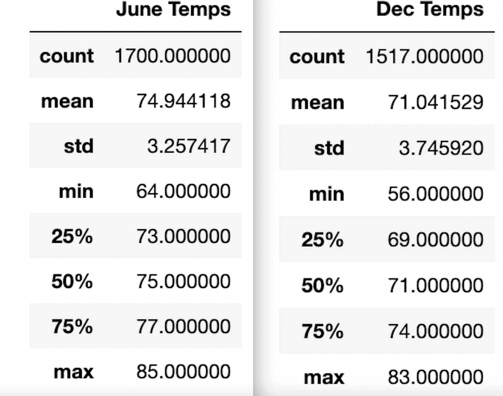

# Surfs Up - Oahu Weather Analysis

## Overview of the analysis
### Surveying one year of weather data from Oahu, Hawaii, to confirm whether the temperature and rainfall are indicate that this is a good location for a year-round combination surf and ice cream shop.

 

## Results
### * On average, Oahu is 6 degrees cooler in December than it is in June, during the period surveyed.

### * The lowest temperature recorded during December, during year of our measurements, was 60 degress. This is in comparison to June's recorded low temperature of 71 degrees.

### * The highest recorded temperature in December was only 5 degrees lower than the temperature in June.

## Summary of the findings
### The swing in temperature from summer to winter in Oahu is relatively small. The data indicate that Oahu's weather makes it a good location for a year-round surf and ice cream business.
